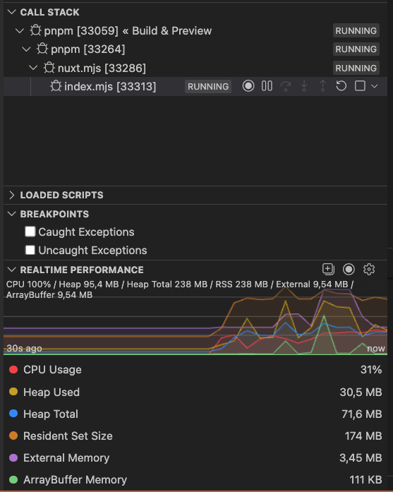

# URQL memory leak with Nuxt 3/4

This repo is a sample reproduction to showcase the memory leak occuring in a Nuxt 3/4 server, when `await useQuery` from URQL.

By removing `await` and only leave `useQuery`, the leak is gone.

Steps to debug the leak in VSCode:
- Open `nuxt-3` or `nuxt-4` with VSCode.
- Install the dependencies with `pnpm i`.
- Open the **Run and debug** section and start `Build & Preview`, which will build and run in "production" mode.
- After Nuxt has built and started the server, expand "*Call stack*" and select the more nested item (`nuxt.mjs` -> `index.mjs`).
- Below, in "*Realtime performance*", select all items.
- Open `localhost:3000` and keep refreshing the page many times. To be faster, in Chrome you can select the URL bar and press `cmd + enter` many times (or keep pressing them) to open new pages and trigger many API calls.
- Now you should be able to see the memory leak, where the *Resident Set Size* is very high, and becomes higher and higher when you trigger many API calls simultaneously. It's also much higher than *Heap Total*.

You should see something like this:

---

Note: since this project uses PokeAPI as a sample (https://beta.pokeapi.co/graphql/v1beta), calls are rate limited.
